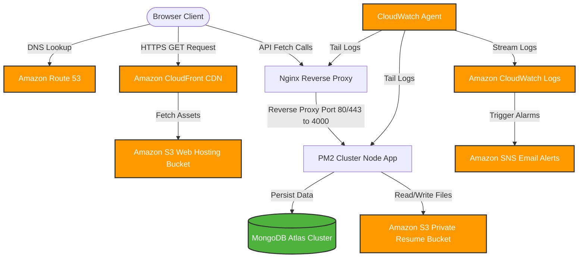

# College Placement Portal

A secure, decoupled, and highly scalable **College Placement Portal** designed to streamline job listings, applications, student profile building, and resume management. 

This repository is structured as a decoupled architecture:
- **`backend/`**: Node.js Express REST API backed by MongoDB Atlas, secured with JWT and Helmet, and integrated with AWS S3 for document storage.
- **`frontend/`**: Vanilla HTML5, ES6 modules, and Tailwind CSS compiled via a custom Node build pipeline, ready for serverless S3 Static Hosting.

---

## 1. System Architecture

The following diagram maps the production architecture deployed on AWS:



---

## 2. Project Directory Structure

```
├── docs/                                  # Implementation & AWS Deployment Runbooks
│   ├── PROJECT_ROADMAP.md                 # 10-Phase Project Roadmap
│   ├── deploy_backend.md                  # PM2 & Nginx EC2 Deployment Runbook
│   ├── deploy_frontend.md                 # S3 Website Hosting & CloudFront CDN Runbook
│   ├── deploy_monitoring.md               # IAM Policies & CloudWatch Alarms Guide
│   └── manual_integration_checklist.md    # Consolidated Manual Services Checklist
└── placement-portal/
    ├── backend/                           # Express REST API Server
    │   ├── aws/                           # CloudWatch Agent configs
    │   ├── config/                        # Mongoose Database connections
    │   ├── controllers/                   # Request Controllers
    │   ├── middleware/                    # JWT Authentication & error handlers
    │   ├── models/                        # Mongoose Schemas (Student, Job, Application)
    │   ├── routes/                        # API route routers
    │   └── utils/                         # Winston Logger utilities
    └── frontend/                          # Client-side Static Web Assets
        ├── css/                           # Custom style modules
        ├── fixtures/                      # Mock testing JSON datasets
        ├── js/                            # Modular REST API clients & UI handlers
        ├── scripts/                       # Cross-platform production build script
        └── src/                           # Source Tailwind CSS files
```

---

## 3. Local Quickstart

### Backend Setup
1. Navigate to the backend directory:
   ```bash
   cd placement-portal/backend
   ```
2. Install dependencies:
   ```bash
   npm install
   ```
3. Set up your `.env` configuration file (refer to `.env.example`):
   ```env
   PORT=4000
   MONGODB_URI=your_mongodb_connection_string
   JWT_SECRET=your_jwt_signing_key
   S3_BUCKET_NAME=your_resume_bucket
   AWS_REGION=us-east-1
   ```
4. Start the application in development mode:
   ```bash
   npm run dev
   ```

### Frontend Setup
1. Navigate to the frontend directory:
   ```bash
   cd placement-portal/frontend
   ```
2. Install Tailwind CSS dev dependencies:
   ```bash
   npm install
   ```
3. Compile the production-ready assets:
   ```bash
   npm run build
   ```
   This generates the `./dist` folder which houses minified stylesheets, Javascript modules, and static assets.

---

## 4. API Endpoints Specification

| Method | Endpoint | Description | Auth Required |
| :--- | :--- | :--- | :--- |
| **POST** | `/api/auth/register` | Register a new student profile | None |
| **POST** | `/api/auth/login` | Authenticate user and return JWT | None |
| **GET** | `/api/jobs` | Retrieve paginated list of jobs | None |
| **GET** | `/api/jobs/:id` | Retrieve job details by ID | None |
| **POST** | `/api/jobs/apply` | Apply to a job listing | Student (JWT) |
| **GET** | `/api/jobs/applied` | Retrieve active student applications | Student (JWT) |
| **GET** | `/api/student/profile` | Retrieve student profile metadata | Student (JWT) |
| **PUT** | `/api/student/profile` | Update student profile metadata | Student (JWT) |
| **POST** | `/api/student/upload` | Retrieve S3 Presigned URL to upload file | Student (JWT) |
| **GET** | `/api/company` | Retrieve all registered companies | None |

---

## 5. AWS Deployments

Refer to the targeted runbooks inside the [docs/](file:///d:/Projects/AWS/docs/) folder:
- **API Server Deployment**: [deploy_backend.md](file:///d:/Projects/AWS/docs/deploy_backend.md)
- **Static Website Deployment**: [deploy_frontend.md](file:///d:/Projects/AWS/docs/deploy_frontend.md)
- **Permissions & Logging Configuration**: [deploy_monitoring.md](file:///d:/Projects/AWS/docs/deploy_monitoring.md)
- **A-to-Z Manual Steps**: [manual_integration_checklist.md](file:///d:/Projects/AWS/docs/manual_integration_checklist.md)
