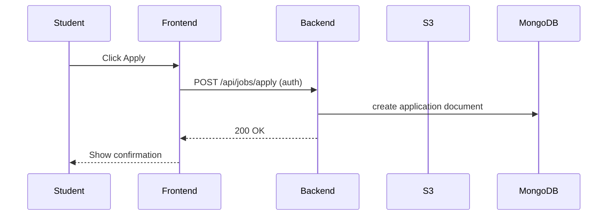

# Phase 1 — Low-fidelity Wireframes

Below are simple ASCII wireframes for core pages. These are low-fidelity sketches to align layout and content. Use them to create the Phase 2 static pages.

1) Login (mobile / desktop)

---------------------------
| Placement Portal         |
| ----------------------- |
| [ Login ]               |
| Email: [__________]     |
| Password: [______]      |
| [ Login Button ]        |
| Forgot?  Register       |
---------------------------

2) Dashboard (student)

----------------------------------------------------
| Sidebar | Topbar (profile icon, logout)           |
|         ----------------------------------------- |
|         | Welcome, <Name>                         |
|         | Quick stats: Applied: 3 | Shortlisted:1 |
|         | Latest Jobs (carousel/list)             |
----------------------------------------------------

3) Jobs List

----------------------------------------------------
| Search [________] [Filter] [Sort]                 |
| ------------------------------------------------ |
| [ JobCard ]  [ JobCard ]  [ JobCard ]            |
| [ JobCard ]  [ JobCard ]  [ JobCard ]            |
----------------------------------------------------

4) Job Detail

----------------------------------------------------
| Job title                                         |
| Company name  | Location | Salary | Apply Button  |
| Description                                      |
| Eligibility                                      |
| Apply (confirm)                                  |
----------------------------------------------------

5) Profile

----------------------------------------------------
| Profile Image  [Upload]  Name: [_____]            |
| Email: [_____]                                   |
| Phone: [_____]   Branch: [_____]  CGPA: [__]     |
| Skills: [tag1, tag2]                             |
| Resume: [Upload / current.pdf]                   |
| [ Save ]                                         |
----------------------------------------------------

6) Admin Dashboard (compact)

----------------------------------------------------
| Sidebar: Companies | Jobs | Students | Reports     |
| Topbar: Admin name                                 |
| Companies list  | Create company button             |
| Jobs list       | Create job button                 |
| Selected job -> Applicants list (with actions)     |
----------------------------------------------------

Sequence example (apply flow)

Design notes
- Prioritize simple, readable UI with clear CTAs.
- Use consistent spacing, accessible colors, and keyboard-friendly forms.
